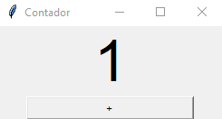
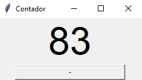
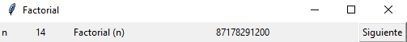
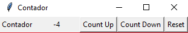
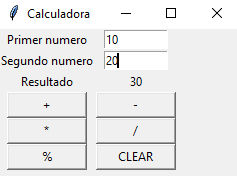
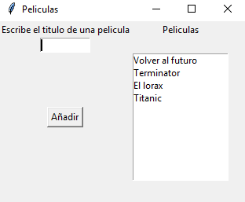
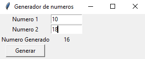
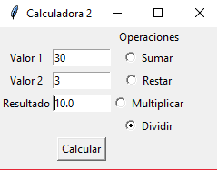

# Ejercicios graficos de programacion Python
El objetivo de estos ejercicios es conocer el uso de la herremienta <a href="https://docs.python.org/3/library/tk.html">**tkinter**</a> en python, la cual nos permite hacer programas con interfaz grafica en para este lenguaje de programación.

## Ejercicio 1
Escribir una aplicación GUI (llamada ContCreciente) como la que se ve en la figura. Cada ves que se haga clic en el botón "+", el valor del contador se incrementa en 1.

<pre><code>
from tkinter import *

root=Tk()
contador = 0
v = StringVar()
root.title("Contador")

etiqueta = Label(root, textvariable=v, font="Helvetica 48")
etiqueta.pack()

def sumar():    
    global v, contador    
    contador = contador + 1    
    v.set(str(contador))

button1 = Button(root, text='+', width=25, command=sumar)

button1.pack()
root.mainloop() 
</code></pre>

## Ejercicio 2
Escribir una aplicación GUI (llamada ContDecreciente) como la que se ve en la figura. Cada ves que se haga clic en el botón "-", al valor de contador se le resta 1.

<pre><code>
from tkinter import *

root=Tk()
contador = 88
v = StringVar()
root.title("Contador")

etiqueta = Label(root, textvariable=v, font="Helvetica 48")
etiqueta.pack()

def restar():    
    global v, contador    
    contador = contador - 1    
    v.set(str(contador))

button1 = Button(root, text='-', width=25, command=restar)

button1.pack()
root.mainloop() 
</code></pre>

## Ejercicio 3
Escribir una aplicación GUI (llamada Factorial) como la que se ve en la
figura. Cada ves que se haga clic en el botón "Siguiente", debe calcular el factorial del primer lineEdit y mostrarlo en el segundo. Al dar siguiente (n se incrementa en 1) n = 2 con su factorial correspondiente.

<pre><code>
from tkinter import *

# Crear una ventana con el título "Factorial"
formulario=Tk()
formulario.title("Factorial")

cont=-1
c=StringVar()
f=StringVar()

# Crear una etiqueta con el texto "n" y colocarla en la primera columna y la primera fila.
lb1=Label(formulario,text="n")
lb1.grid(column=1,row=1)

# Crear una etiqueta donde se muestra el valor de "n" y colocarla en la segunda columna y primera fila.
lb2=Label(formulario,width=10,textvariable=c)
lb2.grid(column=2,row=1)

# Crear una etiqueta con el texto "Factorial (n)" y colocarla en la tercera columna y primera fila.
lb3=Label(formulario,text="Factorial (n)")
lb3.grid(column=3,row=1)

# Crear una etiqueta que muestra el valor del factorial y colocarla en la cuarta columna y primera fila.
lb4=Label(formulario,width=40,textvariable=f)
lb4.grid(column=4,row=1)

def sumar():
    """
    Toma el valor de la variable global cont, le suma 1 y luego establece el valor de la variable global c a la versión de la cadena del nuevo valor de cont
    """
    global c,cont
    cont=cont+1
    c.set(str(cont))
    factorial(cont)

def factorial(cont):
    """
    Toma un número, lo multiplica por todos los números menores que él y devuelve el resultado (Factorial)
    """
    global f
    r=1
    if cont==0:
        f.set(str(1))
    else:
        while cont>1:
            r*=cont
            cont-=1
        f.set(str(r))

# Crear un botón con el texto "Siguiente" y colocarlo en la quinta columna y primera fila.
btn=Button(formulario,text="Siguiente",command=sumar)
btn.grid(column=5,row=1)

# Hacer que la ventana permanezca abierta hasta que el usuario la cierre.
formulario.mainloop()
</code></pre>

## Ejercicio 4
Escribir una aplicación GUI (llamada Contador) como la que se ve en la
figura. Con 3 botones (Count Up - Para incrementar, Count Down - Para restar y Reset - Para comenzar de cero).

<pre><code>
from tkinter import *

# Crear una ventana con el título "Factorial"
formulario=Tk()
formulario.title("Contador")

cont=0
c=StringVar()

# Crear una etiqueta con el texto "Contador" y colocarla en la primera columna y la primera fila.
lb1=Label(formulario,text="Contador")
lb1.grid(column=1,row=1)

# Crear una etiqueta donde se muestra el valor del "Contador" y colocarla en la segunda columna y primera fila.
lb2=Label(formulario,width=10,textvariable=c)
lb2.grid(column=2,row=1)

def sumar():
    """
    Toma el valor de la variable global cont, le suma 1 y luego establece el valor de la variable global c a la versión de la cadena del nuevo valor de cont
    """
    global c,cont
    cont=cont+1
    c.set(str(cont))

# Crear un botón con el texto "Siguiente" y colocarlo en la quinta columna y primera fila.
btn=Button(formulario,text="Count Up",command=sumar)
btn.grid(column=3,row=1)

def restar():
    """
    Toma la variable global cont, le resta 1, y luego establece la variable global c a la versión de cadena de cont
    """
    global c,cont
    cont=cont-1
    c.set(str(cont))

# Crea un botón con el texto "Count Down" y colócalo en la cuarta columna y primera fila.
btn2=Button(formulario,text="Count Down",command=restar)
btn2.grid(column=4,row=1)

def reset():
    """
    Establece la variable global cont a 0 y luego establece el texto de la etiqueta a la versión de cadena de cont.
    """
    global c,cont
    cont=0
    c.set(str(cont))

# Crea un botón con el texto "Reset" y colócalo en la quinta columna y primera fila.
btn3=Button(formulario,text="Reset",command=reset)
btn3.grid(column=5,row=1)

# Hacer que la ventana permanezca abierta hasta que el usuario la cierre.
formulario.mainloop()
</code></pre>

## Ejercicio 5
Escribir una aplicación GUI (llamada Calculadora) que funcione como
una simple calculadora.

<pre><code>
from tkinter import *

# Crear una ventana con el título "Factorial"
formulario=Tk()
formulario.title("Calculadora")

num1=""
num2=""
res=0
r=StringVar()

def sumar():
    """
    Toma el valor de la variable global cont, le suma 1 y luego establece el valor de la variable global c a la versión de la cadena del nuevo valor de cont
    """
    global res,r
    _num1=int(ent.get())
    _num2=int(ent2.get())
    res=_num1+_num2
    r.set(str(res))

def restar():
    """
    Toma los dos números de los cuadros de entrada, los resta y pone el resultado en la etiqueta.
    """
    global res,r
    _num1=int(ent.get())
    _num2=int(ent2.get())
    res=_num1-_num2
    r.set(str(res))

def multiplicar():
    """
    Toma los dos números de las casillas de entrada, los multiplica y luego establece el resultado en la etiqueta.
    """
    global res,r
    _num1=int(ent.get())
    _num2=int(ent2.get())
    res=_num1*_num2
    r.set(str(res))

def dividir():
    """
    Toma los dos números de las casillas de entrada, los divide y luego establece el resultado en la etiqueta.
    """
    global res,r
    _num1=int(ent.get())
    _num2=int(ent2.get())
    res=_num1/_num2
    r.set(str(res))

def por():
    """
    Toma los valores de las dos casillas de entrada, los multiplica, los divide por 100, y luego pone el
    resultado en la etiqueta.
    """
    global res,r
    _num1=int(ent.get())
    _num2=int(ent2.get())
    res=(_num1*_num2)/100
    r.set(str(res))

def reset():
    """
    Establece las variables globales res, r, num1 y num2 a 0 y luego establece el texto de la etiqueta r a
    la versión de cadena de res
    """
    global res,r,num1,num2
    res=0
    r.set(str(res))

# Crear una etiqueta con el texto "Primer numero" y colocarla en la primera columna y la primera fila.
lb1=Label(formulario,text="Primer numero")
lb1.grid(column=1,row=1)

# Crea un cuadro de entrada y lo coloca en la segunda columna y primera fila.
ent=Entry(formulario,width=10,textvariable=num1)
ent.grid(column=2,row=1)

# Crea una etiqueta con el texto "Segundo número" y colócala en la primera columna y segunda fila.
lb2=Label(formulario,text="Segundo numero")
lb2.grid(column=1,row=2)

# Crea un cuadro de entrada y lo coloca en la segunda columna y la segunda fila.
ent2=Entry(formulario,width=10,textvariable=num2)
ent2.grid(column=2,row=2)

# Crea una etiqueta con el texto "Resultado" y colócala en la primera columna y tercera fila.
lb3=Label(formulario,text="Resultado")
lb3.grid(column=1,row=3)

# Crea una etiqueta y la coloca en la segunda columna y tercera fila.
lb4=Label(formulario,textvariable=r)
lb4.grid(column=2,row=3)

# Crea un botón con el texto "+", el comando sumar, y un ancho de 10. A continuación, coloca el botón en la primera columna y en la cuarta fila.
btn=Button(formulario,text="+",command=sumar,width="10")
btn.grid(column=1,row=4)

# Crea un botón con el texto "-", el comando restar, y un ancho de 10. A continuación, coloca el botón en la segunda columna y la cuarta fila.
btn2=Button(formulario,text="-",command=restar,width="10")
btn2.grid(column=2,row=4)

# Crea un botón con el texto "*", el comando multiplicar y un ancho de 10. A continuación, coloca el botón en la primera columna y la quinta fila.
btn3=Button(formulario,text="*",command=multiplicar,width="10")
btn3.grid(column=1,row=5)

# Crea un botón con el texto "/", el comando dividir y un ancho de 10. A continuación, coloca el botón en la segunda columna y la quinta fila.
btn4=Button(formulario,text="/",command=dividir,width="10")
btn4.grid(column=2,row=5)

# Crea un botón con el texto "%", el comando por, y un ancho de 10. A continuación, coloca el botón en la primera columna y sexta fila.
btn5=Button(formulario,text="%",command=por,width="10")
btn5.grid(column=1,row=6)

# Crea un botón con el texto "CLEAR", el comando reset, y un ancho de 10. A continuación, coloca el botón en la segunda columna y sexta fila.
btn6=Button(formulario,text="CLEAR",command=reset,width="10")
btn6.grid(column=2,row=6)

# Hacer que la ventana permanezca abierta hasta que el usuario la cierre.
formulario.mainloop()
</code></pre>

## Ejercicio 6
Escribir una aplicación GUI (llamada Películas). Su función será: al pulsar el botón Añadir, agregará en el listWidget el contenido de lineEdit (Películas).

<pre><code>
from tkinter import *

# Crear una ventana con el título "Factorial"
formulario=Tk()
formulario.title("Peliculas")

pelicula=""

def vPel():
    """
    Toma el texto del widget de entrada, lo pone en una lista, y luego inserta el texto en el listbox.
    """
    print("El la funcion")
    global pelicula
    _pelicula=ent1.get()
    lista=[]
    lista.append(_pelicula)
    print(len(lista))

    for item in lista:
        libx.insert(END,item)
        ent1.delete(0,END)

# Crear un widget de etiqueta y colocarlo en la ventana.
lb1=Label(formulario,text="Escribe el titulo de una pelicula")
lb1.grid(row=2,column=1)

# Crear un widget de etiqueta y colocarlo en la ventana.
lb2=Label(formulario,text="Peliculas")
lb2.grid(row=2,column=4)

# Crear un widget de etiqueta y colocarlo en la ventana.
ent1=Entry(formulario,width=10,textvariable=pelicula)
ent1.grid(row=4,column=1)

# Creating a button widget and placing it in the window.
btn1=Button(formulario,text="Añadir",command=vPel)
btn1.grid(row=5,column=1)

# Crear un widget listbox y colocarlo en la ventana.
libx=Listbox(formulario)
libx.grid(row=5,column=4)

# Hacer que la ventana permanezca abierta hasta que el usuario la cierre.
formulario.mainloop()
</code></pre>

## Ejercicio 7
Escribir una aplicación GUI (llamada Generador de números). Su función será: al pulsar el botón Generar, generará un número aleatorio en el rango de los dos Spin Box.

<pre><code>
from tkinter import *
import random

# Crear una ventana con el título "Factorial"
formulario=Tk()
formulario.title("Generador de numeros")

num1=""
num2=""
res=0
r=StringVar()

def rnd():
    """
    Toma los valores de las dos casillas de entrada, los convierte en enteros y luego utiliza el módulo random
    para generar un número aleatorio entre los dos valores.
    """
    global res,r
    _num1=int(ent.get())
    _num2=int(ent2.get())
    res=random.randint(_num1,_num2)
    r.set(str(res))

# Crear una etiqueta con el texto "Numero 1" y colocarla en la primera columna y la primera fila.
lb1=Label(formulario,text="Numero 1")
lb1.grid(column=1,row=1)

# Crea un cuadro de entrada y lo coloca en la segunda columna y primera fila.
ent=Entry(formulario,width=10,textvariable=num1)
ent.grid(column=2,row=1)

# Crea una etiqueta con el texto "Numero 2" y colócala en la primera columna y segunda fila.
lb2=Label(formulario,text="Numero 2")
lb2.grid(column=1,row=2)

# Crea un cuadro de entrada y lo coloca en la segunda columna y la segunda fila.
ent2=Entry(formulario,width=10,textvariable=num2)
ent2.grid(column=2,row=2)

# Crea una etiqueta con el texto "Numero Generado" y colócala en la primera columna y tercera fila.
lb3=Label(formulario,text="Numero Generado")
lb3.grid(column=1,row=3)

# Crea una etiqueta y la coloca en la segunda columna y tercera fila.
lb4=Label(formulario,textvariable=r)
lb4.grid(column=2,row=3)

# Crea un botón con el texto "Generar" y el ancho de 10. A continuación, coloca el botón en la primera columna y la cuarta fila
btn=Button(formulario,text="Generar",command=rnd,width="10")
btn.grid(column=1,row=4)

# Hacer que la ventana permanezca abierta hasta que el usuario la cierre.
formulario.mainloop()
</code></pre>

## Ejercicio 8
Escribir una aplicación GUI (llamada Calculadora 2) como la que se ve en la figura y que funcione como una calculadora.

<pre><code>
from tkinter import *

# Crear una ventana con el título "Factorial"
formulario=Tk()
formulario.title("Calculadora 2")

num1=""
num2=""
res=0
r=StringVar()
opcion=IntVar()

def selec():
    """
    Toma los dos números de las casillas de entrada y, en función de la opción seleccionada, realiza
    realiza la operación y establece el resultado en la etiqueta.
    """
    global res,r
    _num1=int(ent1.get())
    _num2=int(ent2.get())

    if opcion.get() ==1:
        res=_num1+_num2
        r.set(str(res))
    elif opcion.get() ==2:
        res=_num1-_num2
        r.set(str(res))
    elif opcion.get() ==3:
        res=_num1*_num2
        r.set(str(res))
    else:
        res=_num1/_num2
        r.set(str(res))

# Crear un widget de etiqueta y colocarlo en la ventana.
lb1=Label(formulario,text="Operaciones")
lb1.grid(row=1,column=3)

# Crea un botón de radio con el texto "Sumar" y establece la variable opcion a 1.
rbtn1=Radiobutton(formulario,text="Sumar",variable=opcion,value=1)
rbtn1.grid(row=2,column=3)

# Crea un botón de radio con el texto "Restar" y establece la variable opcion a 2.
rbtn2=Radiobutton(formulario,text="Restar",variable=opcion,value=2)
rbtn2.grid(row=3,column=3)

# Crea un botón de radio con el texto "Multiplicar" y establece la variable opcion a 3.
rbtn3=Radiobutton(formulario,text="Multiplicar",variable=opcion,value=3)
rbtn3.grid(row=4,column=3)

# Crea un botón de radio con el texto "Dividir" y establece la variable opcion a 4.
rbtn4=Radiobutton(formulario,text="Dividir",variable=opcion,value=4)
rbtn4.grid(row=5,column=3)

# Crear un widget de etiqueta y colocarlo en la ventana.
lb2=Label(formulario,text="Valor 1")
lb2.grid(row=2,column=1)

# Crear un widget de etiqueta y colocarlo en la ventana.
lb3=Label(formulario,text="Valor 2")
lb3.grid(row=3,column=1)

# Crear un widget de etiqueta y colocarlo en la ventana.
lb4=Label(formulario,text="Resultado")
lb4.grid(row=4,column=1)

# Crear un widget de etiqueta y colocarlo en la ventana.
ent1=Entry(formulario,width=10,textvariable=num1)
ent1.grid(row=2,column=2)

# Crear un widget de etiqueta y colocarlo en la ventana.
ent2=Entry(formulario,width=10,textvariable=num2)
ent2.grid(row=3,column=2)

# Crear un widget de etiqueta y colocarlo en la ventana.
ent3=Entry(formulario,width=10,textvariable=r)
ent3.grid(row=4,column=2)

# Creating a button widget and placing it in the window.
btn1=Button(formulario,text="Calcular",command=selec)
btn1.grid(row=6,column=2)

# Hacer que la ventana permanezca abierta hasta que el usuario la cierre.
formulario.mainloop()
</code></pre>

<a href="https://github.com/ArturoEmmanuelToledoAguado/GrafPython">Código</a>